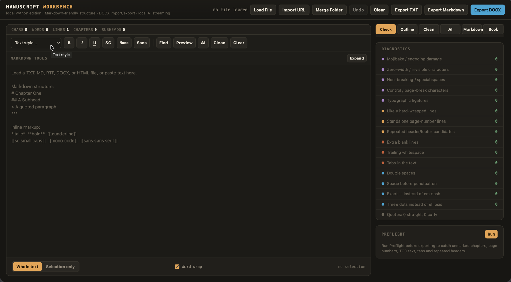

# Manuscript Workbench — Python edition

Local web app for cleaning manuscripts, structuring text with Markdown, importing files or URLs, exporting TXT/Markdown/DOCX, running preflight checks, and streaming rewrite/clean tasks through local OpenAI-compatible providers such as LM Studio and oMLX.

User guide: [USER_GUIDE.md](USER_GUIDE.md)

## Screenshot



## Install

```bash
cd "Manuscript Workbench"
python -m venv .venv
# macOS/Linux
source .venv/bin/activate
# Windows PowerShell
# .venv\Scripts\Activate.ps1
pip install -r requirements.txt
python app.py
```

Open the URL printed in the terminal, normally:

```text
http://127.0.0.1:8765
```

To use another port:

```bash
MANUSCRIPT_WORKBENCH_PORT=8766 ./start_mac_linux.sh
```

## Local AI Providers

The AI tab supports OpenAI-compatible local endpoints:

- LM Studio: `http://localhost:1234/v1`
- oMLX: `http://localhost:8000/v1`
- Ollama: `http://localhost:11434/v1`
- Custom OpenAI-compatible endpoint

Start your provider, choose it in the AI tab, click **Detect Model**, then choose the model.

The app sends `model`, `messages`, and `stream`. Runtime settings such as temperature/top-p/context length stay in the provider app, unless you fill in the optional Advanced request options in the AI tab.

## Markdown Structure

Markdown structure is converted to Word paragraph styles during DOCX export:

```markdown
# Chapter One          -> Heading 1
## A Subhead           -> Heading 2
### Lower Subhead      -> Heading 3
> Quoted paragraph     -> block quote
***                    -> scene break
```

Extra manuscript blocks use fenced Markdown-style containers:

```markdown
::: verse
Poetry or song lines
:::

::: written-note
A note written by a character
:::
```

Inline markup:

```markdown
*italic*
**bold**
`monospace`
[[u:underline]]
[[sc:small caps]]
[[sans:sans serif]]
```

## Saving Text

Use **Export TXT** for clean plain text without Markdown structure characters.

Use **Export Markdown** to keep the editable Markdown manuscript.

Use **Export DOCX** for a formatted Word document.

## Notes

- `.md` / `.markdown` import opens Markdown directly.
- `.docx` import preserves common paragraph styles as Markdown where possible, but it is not a full Word layout converter.
- `.rtf` import is a practical plain-text extraction, not full formatting preservation.
- `.html` / `.htm` import offers simple extraction and Trafilatura main-text extraction before loading.
- **Import URL** fetches an `http`/`https` page and shows the same extraction choice before replacing the editor.
- Old binary `.doc` files should be saved as `.docx`, `.rtf`, or `.txt` first.
